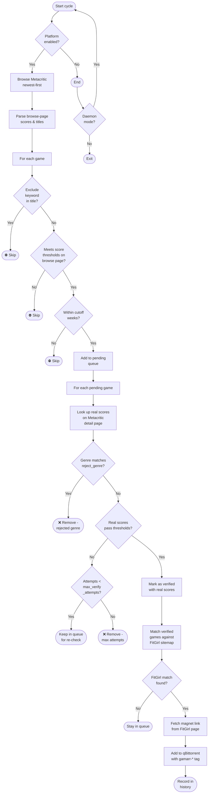

# gamarr

Metadata game downloader — browses Metacritic for newly released games that
pass configured score thresholds, matches them against download sources
(FitGirl repacks, DODI repacks), and sends qualifying games to qBittorrent.
Sources are checked in config-defined priority order.

## Features

- **Two-phase score verification** — browse pages use internal Metacritic
  metrics (not real 0–100 scores) to build a candidate pool quickly.
  Browse scores are on a completely different scale (e.g. 1478, 1931) and
  **always pass** the configured thresholds — the real 0–100 score
  filtering only happens during the detail-page verification step.
  This avoids hundreds of slow HTTP requests while keeping score accuracy.
- **Genre-based rejection** — exclude games by genre using case-insensitive
  substring matching (e.g. `["RPG"]` rejects "Action RPG", "JRPG", etc.).
- **Keyword-based title filtering** — reject games whose titles contain
  specific keywords.
- **Relative date cutoff** — set a look-back window in weeks instead of
  maintaining a static date (e.g. `max_weeks: 52` for roughly one year).
- **Re-verification with expiry** — games whose real Metacritic detail
  page scores don't match the browse page scores are kept in a pending queue
  for re-verification until they expire (`max_queue_days`). Once scores pass
  thresholds, a fresh expiry window begins for the FitGirl-matching phase.
- **Two-phase pending expiry** — games awaiting score review expire after
  `max_queue_days` (under metacritic thresholds). Once scores pass, a fresh
  expiry window (`download_sites.fitgirl.max_queue_days`) starts for the
  FitGirl-matching phase. Set either value to `0` for indefinite pending.
- **Multiple download sources** — supports FitGirl repacks (sitemap-based)
  and DODI repacks (1337x.to scraping). Sources are configured as an ordered
  list — position determines priority, and the first source with a match
  delivers the torrent.
- **Source priority** — if a game is available on multiple sources, the
  highest-priority source in the config list is used. Games that don't match
  any source remain in the pending queue.
- **Database deduplication** — every processed game is recorded in SQLite;
  previously processed titles are never re-processed.
- **Configurable cache TTLs** — Metacritic scores and browse pages are cached
  with independent TTLs to reduce HTTP requests.
- **Notifications** — sends alerts via any
  [apprise](https://github.com/caronc/apprise)-compatible service (ntfy,
  Discord, Telegram, email, and more).
- **Schedule mode** — runs as a scheduled background process, or in foreground mode for
  single-pass execution.
- **Automatic config migration** — upgrades the YAML config schema
  automatically on startup when new fields are added.

## Prerequisites

- [Python 3.12+](https://www.python.org/downloads/)
- [Astral uv](https://github.com/astral-sh/uv#installation)
- [qBittorrent](https://www.qbittorrent.org/) with WebUI enabled

## Quick start

### Installation

```bash
git clone https://github.com/binhex/gamarr
cd gamarr
uv venv --quiet
uv sync
```

### Usage

```bash
# Validate configuration
gamarr --test

# Run a single acquisition cycle
gamarr
```

## CLI Options

| Option | Description |
| ------ | ----------- |
| `--config-path <dir>` | Directory containing `gamarr.yml` (default: `configs`) |
| `--log-level <level>` | Override console log level (DEBUG, INFO, SUCCESS, WARNING, ERROR) |
| `--log-path <path>` | Override log file path |
| `--db-path <dir>` | Override the database directory from config |
| `--pid-path <dir>` | Override the PID file directory from config |
| `--library-path <paths>` | Override library paths (pipe-separated: `--library-path /a\|/b`) |
| `--qbt-host <host>` | Override qBittorrent host from config |
| `--qbt-port <port>` | Override qBittorrent WebUI port from config |
| `--qbt-username <user>` | Override qBittorrent username from config |
| `--qbt-password <pass>` | Override qBittorrent password from config |
| `--test` | Validate configuration and exit |
| `--version` | Show version and exit |
| `--help` | Show help message and exit |

## Configuration

All behaviour is controlled by a YAML file inside the config directory
(`configs/gamarr.yml` by default). A default config is created automatically
on first run. The file is divided into the sections below.

### `general`

| Key | Description | Default |
| --- | ----------- | ------- |
| `config_version` | Schema version — managed automatically; do not edit. | *(current)* |
| `daemon_mode` | `foreground` or `background`. Scheduling is controlled by `schedule.acquisition.enabled`. This field is deprecated. | `foreground` |
| `log_level_console` | Console logging level. | `INFO` |
| `log_level_file` | File logging level. | `INFO` |
| `log_path` | Directory for log files (`gamarr.log` is created inside). | `logs` |
| `db_path` | Directory for the SQLite history database (`gamarr.db` is created inside). | `db` |
| `pid_path` | Directory for the PID file (`gamarr.pid` is created inside). | `pids` |
| `library_path_list` | Override library paths from CLI (`--library-path`). Mapped to `library.paths` at runtime. | `[]` |

### `schedule`

| Key | Description | Default |
| --- | ----------- | ------- |
| `acquisition.enabled` | Enable or disable the acquisition task (scheduled daemon mode). | `false` |
| `acquisition.schedule_time_mins` | Interval in minutes between acquisition cycles. | `60` |
| `acquisition.run_on_start` | Run acquisition immediately on start, before the first interval. | `true` |

### `download_sites`

`download_sites` is an ordered list of source configurations. Each
entry is a single-key dict where the key IS the source name.
Position in the list determines priority — the first source that has
a match delivers the torrent.

```yaml
download_sites:
  - fitgirl:
      enabled: true
      feed_url: https://fitgirl-repacks.site/feed/
      platform: pc
      cache_pages_hours: 6
      reject_keywords: []
      max_queue_days: 60
  - dodi:
      enabled: true
      feed_url: https://1337x.to/user/DODI/
      platform: pc
      cache_pages_hours: 6
      reject_keywords: []
      max_queue_days: 60
```

#### Per-source fields

| Field | Description | Default |
| ----- | ----------- | ------- |
| `enabled` | Enable or disable this source. | `true` |
| `feed_url` | Source URL (RSS feed, user page, etc.). | `None` |
| `platform` | Target platform for matching. | `pc` |
| `cache_pages_hours` | How long to cache the source index before re-fetching. | `6` |
| `reject_keywords` | Reject titles containing any of these keywords (case-insensitive). | `[]` |
| `max_queue_days` | How many days a game stays in the pending queue *after* its scores are verified (the source-matching phase). `0` = indefinite pending (no expiry). | `60` |

### `review_sites.metacritic`

#### `review_sites.metacritic.platform_overrides.<platform>`

| Key | Description | Default |
| --- | ----------- | ------- |
| `min_metascore` | Minimum Metacritic critic score (0–100). | `75` |
| `min_metascore_reviews` | Minimum number of critic reviews required. | `10` |
| `min_user_score` | Minimum Metacritic user score (0–10). | `7.5` |
| `min_user_reviews` | Minimum number of user reviews required. | `10` |
| `max_weeks` | Look-back window in weeks from today. Games released before this are skipped. `null` or `0` = no cutoff. | `13` |
| `max_cycle_weeks` | How many weeks of Metacritic pages to scan per cycle. Reduces HTTP load by limiting browse depth each cycle. `0` or `null` = unlimited (same as not set). | `4` |
| `age_recheck_weeks` | Games older than this (weeks since release) are permanently processed once their Metacritic scores pass thresholds. `null` or `0` = disabled. | `null` |
| `enabled` | Enable or disable the Metacritic browse step. Disabling skips game discovery entirely. | `true` |
| `max_queue_days` | Days a game stays in the pending queue before expiring. `0` = indefinite pending (no expiry). | `30` |
| `cache_details_days` | Days to cache Metacritic detail-page results. | `7` |
| `cache_pages_hours` | Hours to cache Metacritic browse-page results. | `6` |
| `reject_genre` | Reject games whose Metacritic genre contains any of these substrings (case-insensitive). E.g. `["RPG"]` matches "Action RPG", "JRPG", "Western RPG". | `[]` |
| `reject_title` | Reject games whose title contains any of these substrings (case-insensitive). E.g. `["Remake"]` matches "Resident Evil 4 Remake", "Remake Collection". | `[]` |

### `torrent_client`

| Key | Description | Default |
| --- | ----------- | ------- |
| `selected` | Torrent client to use. Currently only `qbittorrent` is supported. | `qbittorrent` |
| `qbittorrent.host` | qBittorrent Web UI hostname or IP address. | `localhost` |
| `qbittorrent.port` | qBittorrent Web UI port. | `8080` |
| `qbittorrent.username` | Web UI username. | `admin` |
| `qbittorrent.password` | Web UI password. | `adminadmin` |
| `qbittorrent.add_paused` | Add torrents in paused state. | `false` |
| `qbittorrent.category` | Category tag applied to all gamarr-managed torrents. | `games-gamarr` |

### `notification`

| Key | Description | Default |
| --- | ----------- | ------- |
| `apprise_urls` | List of [apprise](https://github.com/caronc/apprise) service URLs. Leave empty to disable. | `[]` |
| `on_download` | Send a notification when a game is successfully added to qBittorrent. | `true` |
| `on_failure` | Send a notification when a game fails verification after max attempts. | `false` |
| `on_error` | Send a notification when an error occurs during the acquisition cycle. | `false` |
| `on_scrape_failure` | Send a notification when Metacritic scraping appears to be broken. | `true` |

### `database`

| Key | Description | Default |
| --- | ----------- | ------- |
| `processed_expiry_days` | Delete processed history records older than this many days. | `365` |

### `library`

| Key | Description | Default |
| --- | ----------- | ------- |
| `paths` | List of library root paths to scan when checking whether a game already exists. | `[]` |

## How It Works

### Acquisition pipeline



### Detailed phases

1. **Metacritic browse** — Scans Metacritic browse pages (newest-first) for
   games matching the target platform. **Important:** browse pages show
   *internal browse-only metrics*, not the real 0–100 critic scores or
   0–10 user scores. These rough scores are used only to build a candidate
   pool — the real filtering happens in step 4. Games are collected within the
   `max_weeks` window.
are collected.
2. **Browse-page filtering** — Games whose titles match `reject_title` are
   skipped. Games outside the `max_weeks` window
   are skipped. `max_cycle_weeks` limits how many weeks of Metacritic pages
   are fetched per cycle (default 4), reducing HTTP load while ensuring the
   newest games are always discovered first. **Note:** browse scores are on a different scale and always
   exceed the configured thresholds — score filtering effectively starts
   at the verification step (phase 4), not here.
3. **Pending queue** — Surviving games enter a `pending_games` queue with a
   configurable expiry (`review_sites.metacritic.platform_overrides.*.max_queue_days`,
   default 30, or `0` for indefinite). They wait for a detail-page
   verification pass.
4. **Score verification** — Each pending game's real Metacritic detail page
   is fetched. The real 0–100 critic score and 0–10 user score are compared
   against configured thresholds. Games whose real scores fail the checks
   are kept for re-verification.
   **When scores pass**, the game's expiry is recalculated to
   `now + <source>.max_queue_days` (default 60 per source, or `0` for
   indefinite), giving it a fresh window for the source-matching phase.
5. **Genre rejection** — Before score verification, the game's genres
   (extracted from the detail page) are checked against `reject_genre`.
   Matching games are removed from pending immediately — no score
   evaluation or re-verification (genres never change).
6. **FitGirl sitemap fetch** — Only when there are verified games in the
   queue. The FitGirl repacks sitemap is fetched and indexed.
7. **Source matching** — Verified games are matched against the FitGirl
   sitemap by title. The best-matching repack title gets its magnet link
   fetched.
8. **Delivery** — Matched games are added to qBittorrent with a `gamarr-*`
   tag. The result is recorded in the history database.
9. **Notifications** — Optional Apprise notifications on download, failure,
   or error.

## Architecture

The codebase is structured as a **Metacritic-first** pipeline:

```text
metacritic.py  →  pipeline.py  →  sources/fitgirl.py  →  qbittorrent.py
_(Note: `sources/` is the Python package name for download site implementations — distinct from the config key.)
       ↓              ↓                   ↓                    ↓
   Browse new    Score filter +      Sitemap match         Add torrent
   releases      pending queue       + magnet fetch
```

All configuration is driven by a YAML file (`configs/gamarr.yml`) validated
with Pydantic. The scheduler (`scheduler.py`) runs in single-pass mode by
default, or in continuous scheduled mode when
``schedule.acquisition.enabled`` is ``true``.

## Development

```bash
git clone https://github.com/binhex/gamarr
cd gamarr
uv venv --quiet
uv sync --extra dev
```

Before committing, run the full lint suite:

```bash
pre-commit run --all-files
```

### Running tests

```bash
uv run pytest
```

## FAQ

**Q: What download sites are supported?**

**A:** Currently FitGirl repacks and DODI repacks.

**Q: Can I add Nintendo Switch games?**

**A:** Planned for a future release via Jackett/Prowlarr integration.

**Q: What if qBittorrent is not running?**

**A:** gamarr will log a warning and skip the acquisition cycle.

**Q: How do I reject specific game genres?**

**A:** Use the `reject_genre` option under `review_sites.metacritic.platform_overrides.pc`.
It uses case-insensitive substring matching. For example:

- `["RPG"]` matches "Action RPG", "Western RPG", "JRPG", "RPG"
- `["Western RPG"]` only matches genres containing "Western RPG"
- `["Action"]` matches "Action", "Action RPG", "Open-World Action"

See the [genres section](#review_sitesmetacriticplatform_overridesplatform) for details.

**Q: Why do I see "X from previous cycles" in the log — why aren't those games leaving the queue?**

**A:** Games leave the pending queue in only two ways:

1. **Downloaded** — scores pass thresholds AND a matching torrent is found on FitGirl
2. **Aged out** — `age_recheck_weeks` is set and the game's release date is old enough

Games that are verified but **fail score thresholds**, or **pass but have no FitGirl match**, stay in the queue. They get re-verified each cycle because their scores could change or a new FitGirl repack could appear. If you find the queue growing indefinitely:

- Set `age_recheck_weeks` to a reasonable value (e.g. `52` for one year) to automatically retire old games
- Games with no `release_date` cannot be aged out — this is expected for unreleased or obscure titles
- The message `0 new + X from previous cycles` means browsing didn't find anything new, and all X are carryovers from earlier cycles

**Q: Why does `max_queue_days` have two separate settings — one for Metacritic and one for FitGirl?**

**A:** There are two waiting rooms. When a game is first discovered, it sits
in the first waiting room while gamarr checks its Metacritic scores. The
**review_sites.metacritic `max_queue_days`** is the time limit for this phase — if scores
can't be verified in time, the game is removed.

Once scores pass, the game moves to a second waiting room where it waits for
a source match (e.g. FitGirl or DODI repack). The **per-source `max_queue_days`**
(e.g. ``fitgirl.max_queue_days`` or ``dodi.max_queue_days``) starts a
*fresh countdown* from this point — it doesn't matter how long the game
spent in the first room. This gives the game a full window to find a match,
regardless of how long the score-checking took.

So even if both values are the same (say 30 days each), a game that took
25 days to get scores verified still gets a full 30 days to find a source
match — not just 5.

___
If you appreciate my work, then please consider buying me a beer  :D

[](https://www.paypal.com/cgi-bin/webscr?cmd=_s-xclick&hosted_button_id=MM5E27UX6AUU4)
